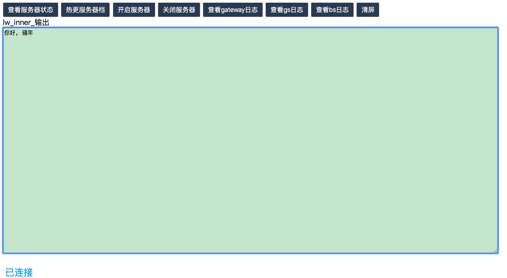
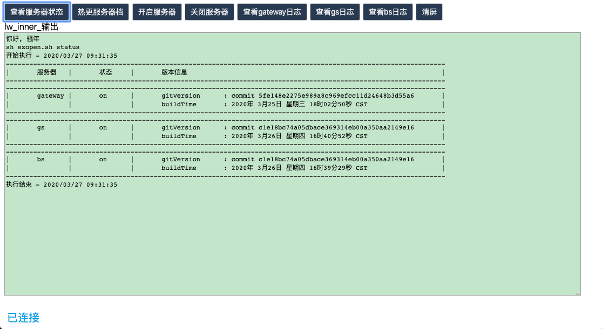

# webcommand

webcommand is a simple and useful tool for server DevOps

## 文件结构与说明

### 需要项目关心的文件

--example：文件夹，一个项目一个文件夹，用于定义项目自定义的按钮、命令、函数、地址等

​		--command.lst：按钮与脚本命令定义。比如：

```go
查看服务器状态:sh ezopen.sh status
```

​		就定义了一个按钮【查看服务器状态】，点击后将会执行冒号后边的命令

​		--ezopen.functions：项目自定义function。初始只需要定义一个函数用于switch执行分支：

```sh
# 遇到未知命令时调用
onUnknownCommand(){
	case "$1" in
	    -h|-?|h|help)
	        printUsage
	        ;;
	    status)
		# 查看所有服务器进程状态
                getAppStatus
		;;
	    *)
		echo "unknown Operation: $1"
		printUsage
		;;
}
```

​		其他项目自定义的函数依次增加函数和switch分支即可，具体可参照letter-war

​		--host.lst：生成文件夹、ip+port、工作目录定义。比如：

```go
example_inner:1.1.1.1:17999:/home/xxx/yyy
```

​		这样就定义了一个管控目录example_inner，启动地址为冒号后的ip:port，工作目录为/home....这里可以定义多个行，比如写成：

```go
example_inner:1.1.1.1:17999:/home/xxx/yyy
example_out:1.1.1.1:17998:/home/xxx/zzz
```

​		这样最后就会生成两个文件夹,example_inner和example_out。用于不同的版本控制。

### 不需要项目关心的文件

​		其他文件都是不需要项目关心的文件，具体实现有兴趣可以看看代码。另外值得注意的是ezopen_common.sh，该文件定义了一些项目公共命令，统一维护。

## 项目使用

* 1、按照上述说明，或者参照example新建一个文件夹用于定义项目需要的信息。

* 2、调用gen.sh生成工具工程，就会生成步骤1定义的文件夹和工程，比如example：

    ```sh
    sh gen.sh example
    ```

* 3、cd到生成的目录中，运行开启脚本，比如example定义的example_inner：

    ```sh
    cd example_inner
    sh run_websocketd.sh
    ```

* 4、关闭：执行stop_websocketd.sh

    ```sh
    sh stop_websocketd.sh
    ```

## 效果

example暂时主要用来给客户端和策划看服务器状态、开关服务器、热更新策划档。服务器程序看日志等。背景色是贴心的豆沙绿~

1、Index：



2、查看服务器状态：



